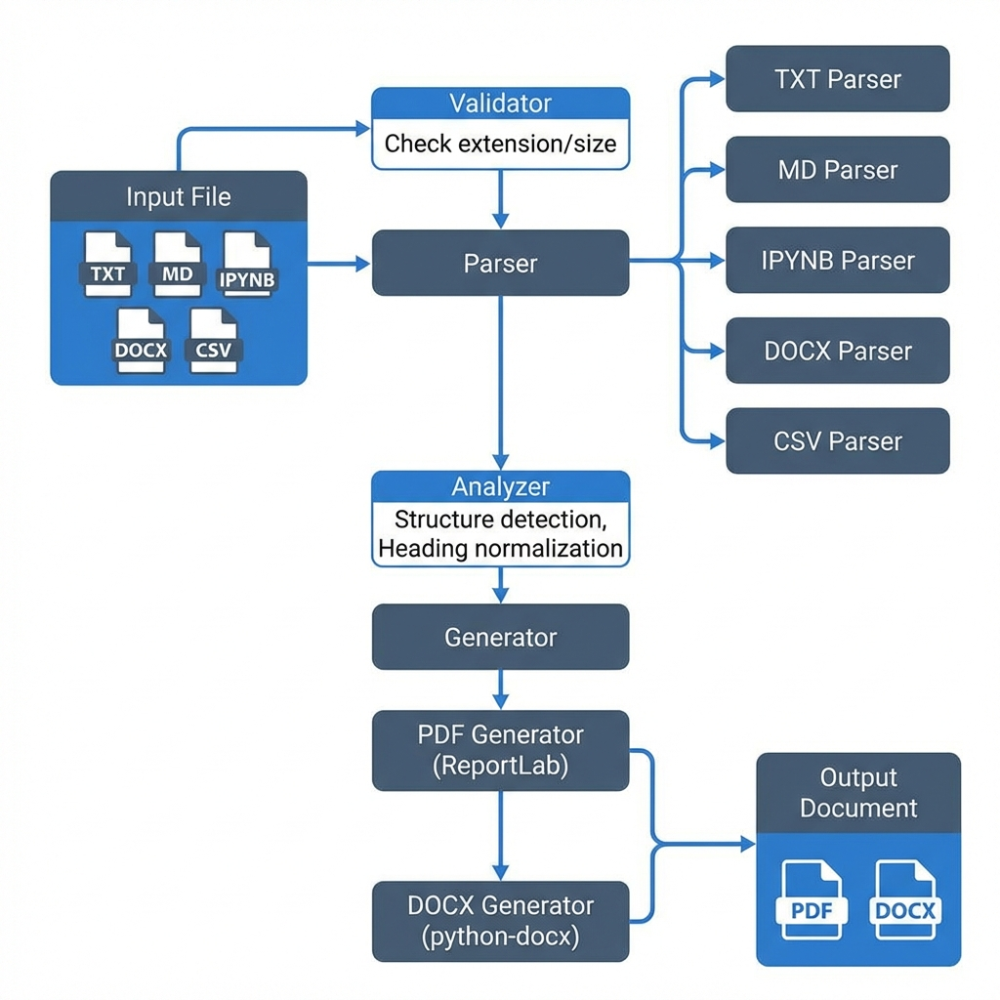

# Semantic File to PDF Converter

**A Python-based, markdown-aware document conversion engine that transforms various file formats into professionally formatted PDF and DOCX documents.**



## Overview

The **Semantic File to PDF Converter** is a robust web application built with **Gradio**, **ReportLab**, and **Python-docx**. Unlike simple text-to-pdf tools, this application understands the *semantic structure* of your documents—detecting headings, lists, code blocks, and tables—to generate clean, publishing-ready outputs.

Key capabilities include **syntax highlighting** for code blocks, **Jupyter Notebook (`.ipynb`) support**, and **smart structure detection** for plain text files.

## Key Features

- **Markdown Intelligence**: Renders Markdown syntax (Headings, Bold/Italic, Lists, Blockquotes) with high fidelity.
- **Jupyter Notebook Support**: Converts `.ipynb` files into clean reports, preserving code cells with syntax highlighting.
- **Syntax Highlighting**: Automatically formats and color-codes code blocks for improved readability.
- **Smart Text Analysis**: Auto-detects structure in plain `.txt` files (e.g., converting UPPERCASE lines to headings).
- **Dual Output Support**: Export your documents to either **PDF** or **DOCX**.
- **Professional Templates**: Choose from built-in style templates (e.g., *Classic*, *Modern*, *Minimal*).
- **Robust Validation**: Ensures file integrity with type checking and size limits.

## Technical Architecture

The application follows a modular **Layered Architecture** design:

1.  **Validator Layer**: Enforces file size limits and extension checks.
2.  **Parser Layer**: Specialized parsers for each file type (`parse_md`, `parse_ipynb`, `parse_txt`, etc.) extract raw content.
3.  **Analyzer Layer**:
    - **Structure Scanner**: Heuristically detects structure in plain text.
    - **Normalizer**: Standardizes content into a common `StructuredDocument` format (Blocks).
4.  **Generator Layer**:
    - **PDF Engine**: Uses `ReportLab` Platypus for flowable-based PDF generation.
    - **DOCX Engine**: Uses `python-docx` for Word document creation.

## Tech Stack

- **Language**: Python 3.9+
- **UI Framework**: [Gradio](https://gradio.app/) (Blocks API)
- **PDF Generation**: [ReportLab](https://www.reportlab.com/)
- **DOCX Generation**: [python-docx](https://python-docx.readthedocs.io/)
- **Markdown Parsing**: [markdown-it-py](https://markdown-it-py.readthedocs.io/)
- **Syntax Highlighting**: [Pygments](https://pygments.org/)

## 📂 Project Structure

```text
pdf_conversion/
├── app/
│   ├── main.py                 # Application Entry Point (Gradio UI)
│   ├── analyzers/              # Content Analysis & Structure Detection
│   ├── docx/                   # DOCX Generation Logic
│   ├── enums/                  # Constants & Enums (FileTypes, Templates)
│   ├── parsers/                # File Parsers (MD, IPYNB, TXT, etc.)
│   ├── pdf/                    # PDF Generation Logic (ReportLab)
│   ├── templates/              # Style Configuration
│   ├── utils/                  # Utilities (Syntax Highlighting, Validation)
│   └── validators/             # File Validation Rules
├── assets/                     # Project Assets (Images, Diagrams)
├── tests/                      # Unit & Reproduction Tests
├── requirements.txt            # Project Dependencies
└── README.md                   # Project Documentation
```

## Installation & Setup

1.  **Clone the Repository**
    ```bash
    git clone https://github.com/Shashwath-K/Python_based_smart_pdf_converter.git
    cd pdf_conversion
    ```

2.  **Create a Virtual Environment**
    ```bash
    python -m venv venv
    # Windows
    .\venv\Scripts\Activate
    # Mac/Linux
    source venv/bin/activate
    ```

3.  **Install Dependencies**
    ```bash
    pip install -r requirements.txt
    ```

4.  **Run the Application**
    ```bash
    python -m app.main
    ```
    The application will launch locally at `http://127.0.0.1:7860`.

## 📖 Usage Guide

1.  **Upload**: Drag and drop your file (Supported: `.md`, `.ipynb`, `.txt`, `.docx`, `.csv`).
2.  **Configure**:
    - Select a **Template** (Classic, Modern, etc.).
    - Choose **Output Format** (PDF or DOCX).
    - Toggle **"Use Filename as Title"** if desired.
3.  **Advanced (TXT Only)**:
    - **Auto-Structure**: Check this to automatically convert capitalized lines into Headings.
    - **Bulletize**: Check this to turn every paragraph into a bullet point.
4.  **Convert**: Click **"Convert Document"** and download your result.

## Contributing

Contributions are welcome! Please follow these steps:
1.  Fork the repository.
2.  Create a feature branch (`git checkout -b feature/AmazingFeature`).
3.  Commit your changes (`git commit -m 'Add some AmazingFeature'`).
4.  Push to the branch (`git push origin feature/AmazingFeature`).
5.  Open a Pull Request.

## 📄 License

Distributed under the MIT License. See `LICENSE` for more information.

---
*Built with 💙 by Shashwath-K*